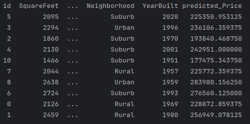

# AutoML Training and Batch Prediction
Create an AutoML tabular regression model on house price prediction and batch prediction using 
the Vertex AI SDK for Python. You can alternatively create and deploy models using the 
gcloud command-line tool or batch using the Cloud Console.

#### Uses the Google Cloud ML services:

* Vertex AI Datasets (Tabular)
* Vertex AI Training (AutoML Tabular Training)
* Vertex AI Model Registry
* Vertex AI Batch predictions
 
## Dataset 
In this project, I utilize a dataset for predicting house prices. The dataset includes 
features such as ID, square footage, number of bathrooms, number of bedrooms, year built,
and neighborhood. These features are utilized to forecast the price of a house.

#### Managed dataset

Transfer the dataset from local machine to a GCP bucket, then establish a tabular
dataset with its source originating from the GCP bucket and  save the display_name of that dataset.
Using the display_name, I obtain the dataset path from Vertex AI, enabling the retrieval of the 
dataset for model training.

## AutoML ModelTraining
Cloud AutoML helps you easily build high quality custom machine learning models with limited machine
learning expertise needed.Build your own custom machine learning model in minutes.

#### House Price Prediction Model

In this project, I develop an AutoML model for predicting house prices. After initiating the training
process, the model undergoes training, and eventually, we obtain the trained model after a certain
duration.

#### Batch Prediction
We possess the input dataset for batch prediction named input.csv, and we anticipate that the
process will be completed in under one hour. Subsequently, we retrieve the batch-predicted data 
from the Google Cloud Storage bucket to local system in csv format.

## Screenshot 
#### batch_predicted_dataset.csv

